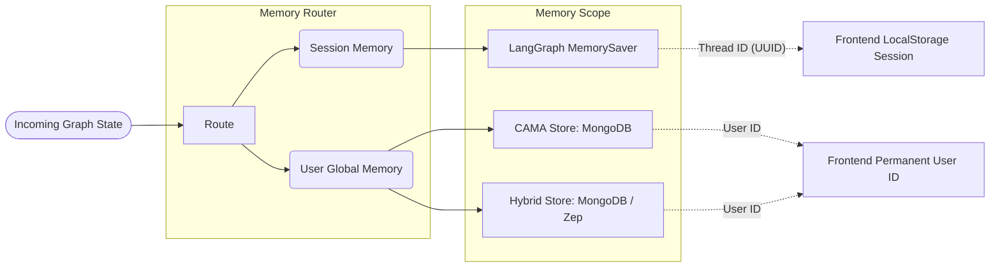
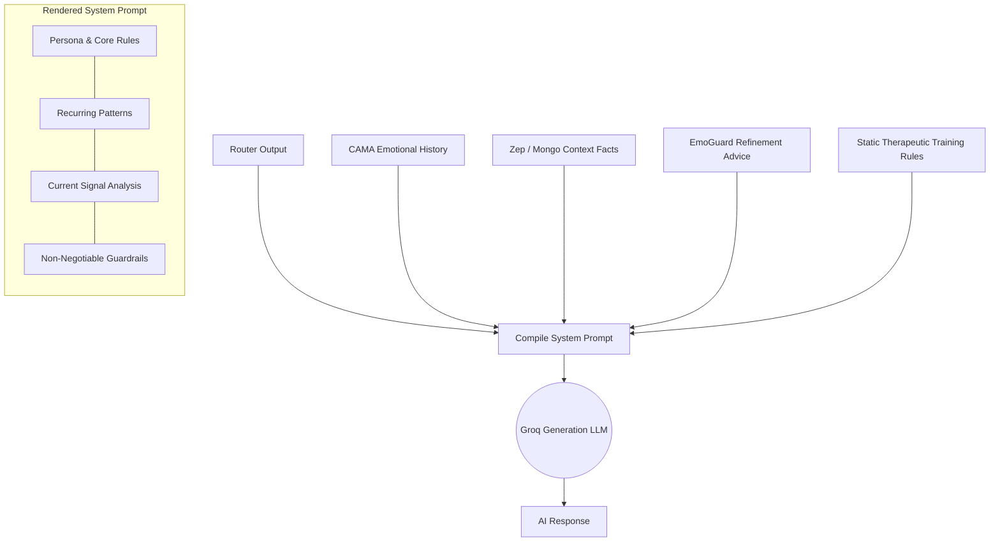

# Wellness AI Workflow & Architecture

This document contains structured flowcharts and technical explanations of how data moves through Wellness AI — from the moment a user sends a message to the final rendered response. 

## 1. High-Level Chat Pipeline

Every user message sent over the WebSocket triggers the **LangGraph State Machine**. The graph processes the message through a pipeline of specialized nodes.

```mermaid
flowchart TD
    User([User Message]) --> WS[WebSocket Server]
    WS --> Intake[intake node]
    
    subgraph LangGraph Pipeline
        Intake --> Router[router node (Groq LLaMA)]
        
        Router --> CheckCrisis{Crisis Level >= 4?}
        
        CheckCrisis -- Yes --> Crisis[crisis node (Hardcoded Safety)]
        CheckCrisis -- No --> MemFetch[memory_fetch node]
        
        MemFetch --> Gen[generation node (Groq LLaMA)]
        
        Gen --> Guard[emoguard node]
        
        Guard --> CheckRefine{Should Refine & Count < 2?}
        CheckRefine -- Yes --> Gen
        CheckRefine -- No --> Out[output node]
        
        Crisis --> MemUpdate[memory_update node]
        Out --> MemUpdate
    end
    
    MemUpdate --> Finetune[(Finetune Logger)]
    MemUpdate --> DB[(Memory Stores)]
    MemUpdate --> Client([WebSocket Response])
```

### Node Descriptions:
1. **Intake**: Initializes the LangGraph state with the new message and ensures the long-term memory session is primed.
2. **Router**: A fast LLM call that analyzes the message in strict JSON, identifying emotions, safety concerns, implicit needs, and volatility.
3. **Crisis**: A safety bypass. If the router detects severe risk, generation is skipped entirely and clinically-grounded hardcoded guidance is returned.
4. **Memory Fetch**: Queries the memory stores based on the router's semantic tags and emotional analysis.
5. **Generation**: Assembles the massive system prompt (context + rules) and generates the AI response.
6. **EmoGuard**: A post-generation LLM call that critiques the generated response. It acts as an internal therapeutic supervisor. If it finds the response harmful or generic, it triggers a retry loop.
7. **Output**: Commits the final response to the active state.
8. **Memory Update**: Persists the session turn into the Memory databases and triggers the asynchronous Fine-Tune logger.

---

## 2. Memory Architecture & Routing

Wellness AI maintains the boundaries between short-term conversational flow and long-term psychological history using dual-scoped memory.



### Memory Layers
- **Session Memory (Short-Term)**: Retained strictly in memory via LangChain's `MemorySaver`. Bound to `sessionId`. It holds the exact history of chat bubbles from the current window context. If you start a "New Chat", this clears, but the deeper memory layers remain.
- **CAMA (Circular Associative Memory)**: A ring buffer stored in MongoDB. Filters and remembers extremely strong emotional peaks (`intensity > 0.3`). This drives the AI's understanding of your recurrent struggles.
- **Hybrid Context**: Intersects basic keyword matching (MongoDB RAG) with Zep Cloud's advanced knowledge graphs.

---

## 3. Dynamic Prompt Assembly

Before calling the main Generation LLM, the `generationNode` builds a massive, highly structured context block dynamically. This is how the AI "knows" who you are.



### Logic Routing behind Prompt Rules
The prompt shifts its conversational rules conditionally based on the `implicit_need` detected by the Router LLM.
- **If `venting`**: The LLM is explicitly forbidden from giving solutions. It is forced into a validation-only sub-state.
- **If `advice`**: The LLM is instructed to briefly validate, and then collaboratively explore small steps forward.
- **If `sarcasm_detected=true`**: The LLM is instructed to read between the lines and acknowledge the tonal dissonance gently.
